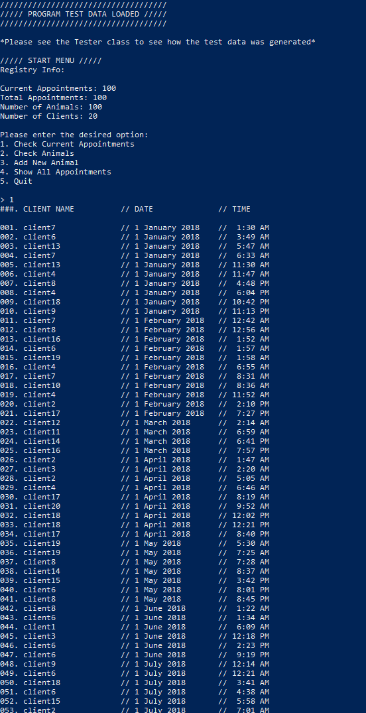

# f17-cs141-project3
Project to practice object oriented programming and specifically implementation of Comparable objects.

This project demonstrates an example program that would be used by a veterinary office, logging current appointments with clients, storing
client info as well as info of all the animals taken care of by this veterinary office. Data can also be retained after exiting the
program.

#### Running the program
Once in the bin folder, this program can be run with, assuming Java is installed properly:

`java -classpath . edu.cpp.cs.cs141.prog_assgmnt_3.Main`

Also, this program can be demonstrated with test data using the following command instead:

`java -classpath . edu.cpp.cs.cs141.prog_assgmnt_3.Main -test`

Here is an example output of the program using test data:

